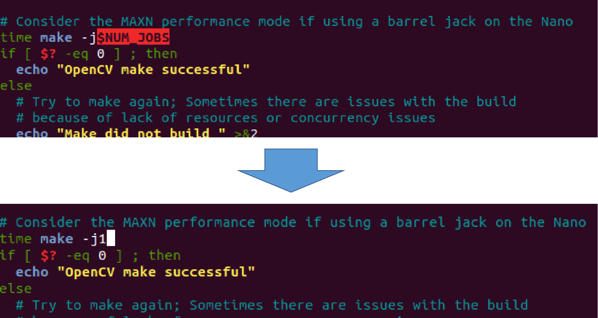
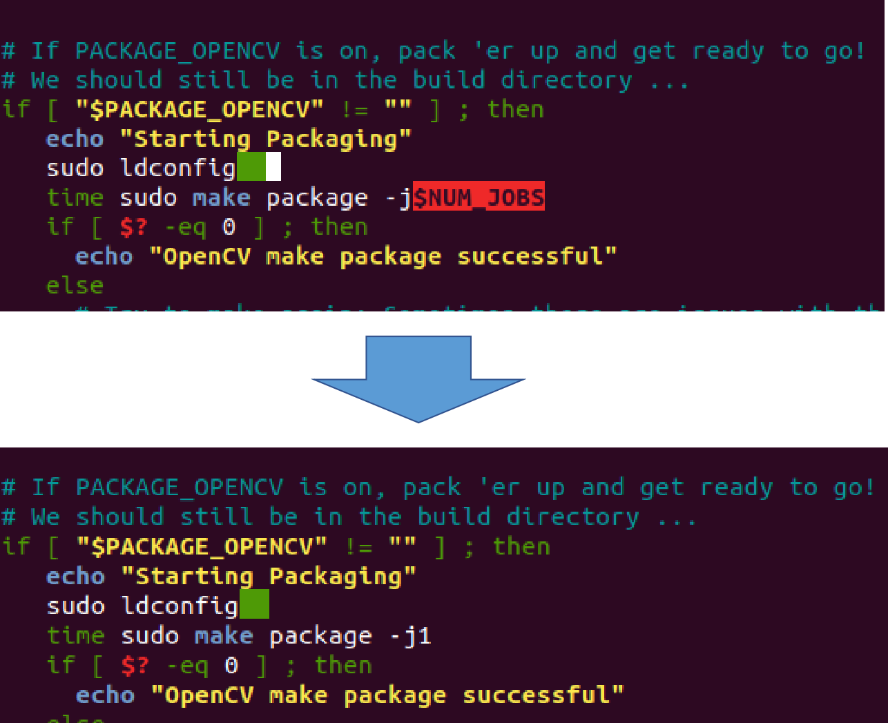

# Yolov5-with-opencv-cuda-jetson

Tutorial on installing Yolov5 OpenCV CUDA on Jetson


## Installation

- Requirement
```bash
  python version 3.6 
```
- Install nano
```bash
  sudo apt install nano
```
- Uninstall default opencv
```bash
  sudo apt-get purge '*opencv*'
```
- Clone yolov5 repository
```bash
  git clone https://github.com/ultralytics/yolov5.git
```
- Clone opencv repository
```bash
  git clone https://github.com/JetsonHacksNano/buildOpenCV.git
```
- Edit buildOpenCV.sh file
```bash
  cd buildOpenCV
  sudo nano buildOpenCV.sh
```
  edit 1
  
  
  edit 2
  

  #Save modification and close the file
  ctrl+o 
  ctrl+x
- Build OpenCV
```bash
  cd buildOpenCV
  ./buildOpenCV.sh
```
- Install other packages
```bash
  sudo apt-get install python3-pip
  pip3 install PyYAML==5.3.1
  pip3 install tqdm
  pip3 install cython
  sudo apt install build-essential libssl-dev python3-dev
  pip3 install cycler==0.10
  pip3 install kiwisolver==1.3.1
  pip3 install pyparsing==2.4.7
  pip3 install python-dateutil==2.8.2
  pip3 install matplotlib==3.2.2
  sudo apt install gfortran
  sudo apt install libopenblas-dev
  sudo apt install liblapack-dev
  pip3 install scipy==1.4.1
  sudo apt install libjpeg-dev
  pip3 install pillow==8.3.2
  pip3 install typing-extensions==3.10.0.2
```
- Install pytorch
```bash
  cd 
  wget https://nvidia.box.com/shared/static/p57jwntv436lfrd78inwl7iml6p13fzh.whl -O torch-1.10.0-cp36-cp36m-linux_aarch64.whl
  sudo apt-get install python3-pip libopenblas-base libopenmpi-dev libomp-dev
  pip3 install --no-deps torch-1.10.0-cp36-cp36m-linux_aarch64.whl
  sudo apt-get install libjpeg-dev zlib1g-dev libpython3-dev libopenblas-dev libavcodec-dev libavformat-dev libswscale-dev
  git clone --branch v0.9.0 https://github.com/pytorch/vision torchvision 
  cd torchvision
  export BUILD_VERSION=0.9.0
  python3 setup.py install –user
  pip3 install –no-deps seaborn==0.11.0
```
## Reference Link
- Pytorch for jetson version
https://forums.developer.nvidia.com/t/pytorch-for-jetson-version-1-10-now-available/72048
- Estimating position of the objects using Jetson Nano and YOLOv5
https://www.youtube.com/watch?v=oKaLyow7hWU&ab_channel=robotmania
## Authors

- [@Yumnasilvia](https://www.github.com/Yumnasilvia)

